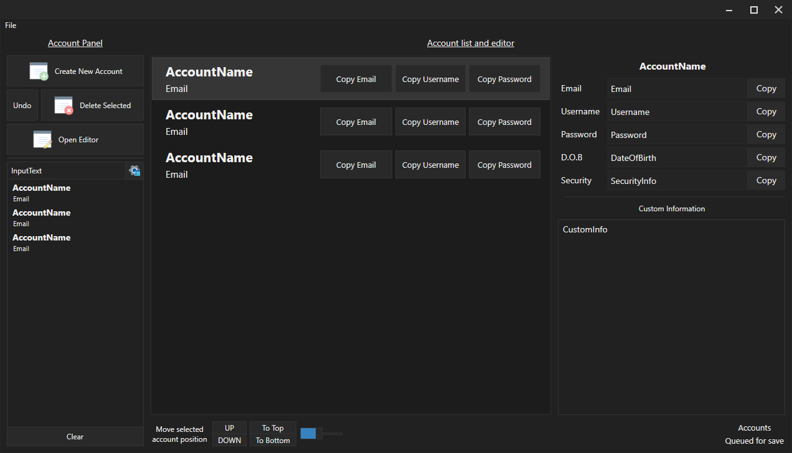

# REghZyAccountManagerV6
A password manager

A simple password manager written in C# using WPF (MVVM)

This doesn't use encrypted account files... yet.

## Preview

I screenshotted this from the XAML designer, which is why it may look a bit pixellated, and is also why all the accounts are the same

## New features
I finally got the "latching" grid splitter to work, so now it behaves like Ableton live's bottom panel; the left/right panels will only close to a certain width, and if the mouse is dragged further then they will fully close. Double click also open/closes them!

I converted most of the project to a Core project, and used IoC (i created my own container called SimpleIoC, used as a static instance in the IoC class) to communicate with the WPF project. The way i was doing it before was beyond aweful where i had global window instances or something like that

### Progress/load/save indicator
I tried to implement it as a window-styled indicator, but loading/saving is too fast and the window doesn't even open some times because it just gets closed a few milliseconds later. I then tried to implement it as IAccountActivityView (implmemented in the main window) which contains the Message and IsVisible properties, but that's either too slow, or WPF is prioritising the account list rendering over the activity text block :( 
